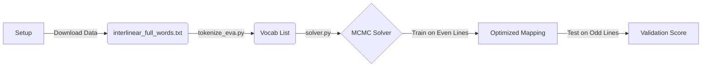

# Voynich Positional Decoder (Version 2.0)

This repository hosts the **Version 2.0** framework for decoding the Voynich Manuscript. It tests the hypothesis that the manuscript encodes natural language using a **Positional Cipher**—where the mapping of glyphs to letters depends on their position within a line (Start, Body, End)—and that the underlying vocabulary can be learned via **Byte Pair Encoding (BPE)**.

---

## 🚀 Key Features (V2.0)

### 1. Positional Decoder
Unlike simple substitution ciphers (and our V1 Legacy model), this decoder applies different mappings depending on the glyph's position:
*   **Line Start:** High-entropy state, specific mapping.
*   **Line Body:** Standard state.
*   **Line End:** Low-entropy/terminator state, specific mapping.

### 2. Learned Vocabulary (BPE)
Instead of hard-coding definitions for "glyphs" (e.g., treating `ch` as two letters `c` and `h`), V2 uses a simplified **Byte Pair Encoding (BPE)** algorithm to learn the manuscript's "atomic" tokens. It automatically merges frequent pairs (e.g., `c` + `h` -> `ch`, `q` + `o` -> `qo`) to build a vocabulary that better reflects the script's structure.

### 3. MCMC Optimization (Simulated Annealing)
We use a **Simulated Annealing** solver to find the optimal mapping. The solver:
1.  Splits the manuscript into **Training** (even lines) and **Test** (odd lines) sets.
2.  Optimizes the mapping on the Training set to maximize **Trigram Cosine Similarity** with a target language (e.g., English or Italian).
3.  Evaluates the final mapping on the held-out Test set to check for generalization (not just overfitting).

---

## 📦 Pipeline

The V2 pipeline consists of three main stages:



---

## 🛠️ Usage

For detailed instructions, see [INSTRUCTIONS.md](INSTRUCTIONS.md).

### 1. Setup
Install dependencies and download the extensive `interlinear_full_words.txt` dataset and NLTK corpora.
```bash
pip install -r requirements.txt
python3 setup_v2.py
```

### 2. Tokenize
Learn the vocabulary from the manuscript.
```bash
python3 tokenize_eva.py
```
This generates `data/vocab_a.txt`.

### 3. Solve
Run the Simulated Annealing solver to find the best mapping.
```bash
python3 solver.py
```

---

## 📜 Legacy Version 1.0

*For historical reference only.*

Version 1.0 tested a static **Modular-23 Inverse Mapping** hypothesis. It used a fixed 23-letter alphabet and decoded "EVA" transcription text directly using a hardcoded math function ($x^{-1} \pmod{23}$).

To run the legacy experiment:
```bash
python3 run_experiment.py
```
*(Note: V1 relies on simple text files and does not use the sophisticated V2 data loader or tokenizer.)*

---

## ⚠️ Limitations & Disclaimers

*   **Hypothesis, not Translation:** This tool finds mappings that *statistically resemble* natural language. It does not guarantee that the resulting text is a valid translation.
*   **Currier A Only:** The current setup defaults to analyzing **Currier Language A**.
*   **Allographic Variation:** BPE helps, but subtle scribal variations are still flattened by the EVA transcription system.
