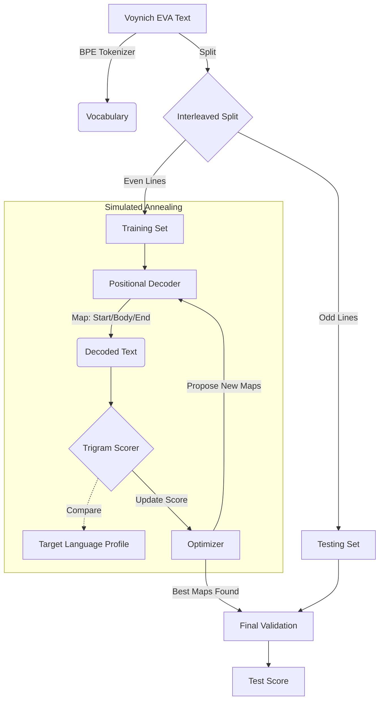

# Voynich Manuscript Decoder v2.0

This repository contains an advanced computational framework for decoding the Voynich Manuscript. It implements a **Positional Decoder** optimized via **Simulated Annealing (MCMC)** to test the hypothesis that the text is a state-dependent polyalphabetic cipher.

---

## Hypothesis: State-Dependent Polyalphabetic Cipher

We hypothesize that the "EVA" transcription of the Voynich Manuscript is not a simple monoalphabetic substitution, but a polyalphabetic system where the mapping changes based on the glyph's position within a line.

Specifically, we model the line as having three distinct states:
1.  **Start:** The first token of the line.
2.  **Body:** The middle tokens.
3.  **End:** The last token of the line.

Our goal is to learn three separate mapping functions ($f_{start}, f_{body}, f_{end}$) that maximize the linguistic similarity of the decoded text to a target language (e.g., 15th-century Latin, Italian, or English).

---

## Methodology

The pipeline uses an iterative optimization process to learn the decoding mappings.

### 1. Vocabulary Learning (BPE)
Instead of treating every EVA glyph as atomic, we use a simplified Byte Pair Encoding (BPE) algorithm to learn a vocabulary of common tokens (e.g., merging `c` and `h` into `ch`).

### 2. Metric: Trigram Cosine Similarity
We evaluate the quality of a candidate decryption by comparing its **trigram frequency vector** to that of a reference corpus (e.g., the Brown Corpus or UDHR). A higher cosine similarity indicates a more natural-looking text structure.

### 3. Optimization: Simulated Annealing
Because the search space for three simultaneous 26-letter permutations is incredibly vast ($26!^3$), we use Markov Chain Monte Carlo (MCMC) methods—specifically Simulated Annealing—to find an optimal configuration.

### 4. Validation: Interleaved Split
To prevent overfitting (where the solver just memorizes the specific letters that make *this* text look like English), we split the manuscript lines into **Training (Even Lines)** and **Testing (Odd Lines)** sets.
*   **Train:** The solver sees these lines and optimizes the mapping to maximize their score.
*   **Test:** The final mapping is applied to these held-out lines. A high score here indicates the pattern is generalizable.

---

## Usage

See [INSTRUCTIONS.md](INSTRUCTIONS.md) for a step-by-step guide on setting up and running the experiment.

---

## Legacy Experiments (v1.0)

**Modular-23 Hypothesis**

Our initial experiment tested a simpler hypothesis: that the text was encoded via a fixed modular-23 inverse mapping ($x^{-1} \pmod{23}$).
*   **Code:** `run_experiment.py`
*   **Findings:** While statistically distinguishable from random noise, the Mod-23 mapping failed to produce readable text or reach natural language metric thresholds. This code is retained for historical comparison.
