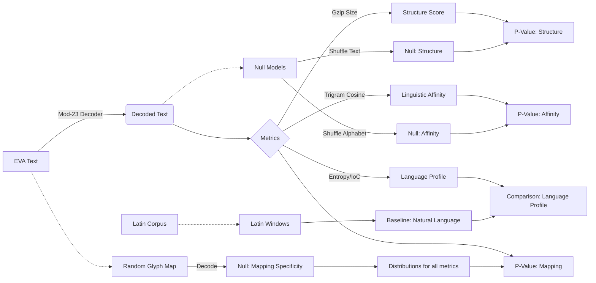

# Modular-23 Decoder for Voynich Manuscript

This repository contains an experimental framework to test the hypothesis that the Voynich Manuscript's text, specifically the "EVA" transcription, is not a random construction but rather a meaningful text encoded via a **modular-23 inverse mapping**.

---

## Hypothesis

This project tests whether a specific modular-23 inverse mapping from Voynich EVA glyph sequences into a 23-letter Latin alphabet produces output with measurable natural-language structure. After decoding, we compare:

*   **Compression** (gzip size)
*   **Character-level Shannon entropy**
*   **Index of coincidence**
*   **Trigram distribution similarity to Latin**

We test these metrics against three rigorous null models:
1.  **Structure Null:** Random character shuffles (tests for sequential order).
2.  **Linguistic Affinity Null:** Random alphabet substitutions (tests if the specific letters matter).
3.  **Mapping Specificity Null:** Random glyph-to-number mappings (tests if the chosen mapping is special).

We also compare the results against a **baseline distribution of real Latin text windows** to see if the decoded text falls within the "natural language" range.

---

## The Pipeline

The experiment flows through three stages: **Decode**, **Measure**, and **Verify**.



### 1. Decode
We map EVA glyphs to integers (1-23), compute their modular inverse ($x^{-1} \pmod{23}$), and map the result to a 23-letter Latin alphabet (`A`..`Z` excluding `J`, `K`, `U`).

### 2. Measure
We calculate metrics on the decoded text.
*   **Gzip Size:** A proxy for Kolmogorov complexity. Lower size = higher predictability/structure.
*   **Trigram Cosine Similarity:** Measures how "Latin-like" the letter triplets are.
*   **Entropy & IoC:** Measures of information density and repetition.

### 3. Null Models & Baselines
To prove significance, we compare our observed metrics against simulations:
*   **Text Shuffle:** Randomly scrambles characters. Tests if the *order* of characters matters.
*   **Alphabet Permutation:** Randomly swaps which number maps to which letter on the decoded text. Tests if the *specific letters* matter.
*   **Glyph Mapping Shuffle:** Randomly assigns numbers (1-23) to EVA glyphs. Tests if the *specific EVA-to-Number mapping* is statistically significant compared to random mappings.
*   **Latin Windows:** Random samples of real Latin text of the same length. Tests if the output *looks like natural language* (e.g. is the entropy similar to real Latin?).

---

## Sample Output

A typical run produces a JSON result and histograms.

```json
{
  "metrics": {
    "gzip": {
      "observed": 123456,
      "null_text_shuffle": {
          "p_value_smaller": 0.045
      },
      "null_glyph_mapping": {
          "p_value_smaller": 0.012
      }
    },
    "trigram_cosine": {
      "observed": 0.2741,
      "null_alphabet_shuffle": {
          "p_value_greater": 0.00001
      },
      "null_glyph_mapping": {
          "p_value_greater": 0.003
      },
      "latin_windows": {
          "mean": 0.35,
          "p_value_greater": 0.12
      }
    },
    "entropy": {
      "observed": 4.12,
      "latin_windows": {
        "mean": 4.05,
        "std": 0.05
      }
    }
  }
}
```

---

## Limitations & Known Caveats

While the results are intriguing, the following constraints must be acknowledged:

### Single transcription source
All experiments use the Takahashi EVA transcription as a fixed input. Different diplomatic transcriptions exist; any systematic differences in glyph segmentation or line handling will propagate into the statistics.

### EVA treats spaces as word boundaries
The pipeline inherits the assumption that spaces in the transcription correspond to meaningful “word” breaks. The underlying manuscript may encode line/paragraph structure differently than normal language.

### Tokenization treats EVA glyph groups as atomic symbols
Multi-character EVA sequences like `ch`, `sh`, `qo`, etc., are treated as single glyphs according to the standard EVA convention. Alternative segmentations are not explored here.

### Allographic variation is collapsed
Scribal variants and subtle shape differences that may be meaningful in the manuscript are already normalized away in EVA, and thus invisible to this analysis.

### Uncertain/rare glyphs
Extremely rare or ambiguous glyphs are either mapped into a catch-all category or filtered out. This can slightly bias frequency-based measures.

---

## Usage

### Installation
```bash
pip install -r requirements.txt
```

### Running the Experiment
You must provide real EVA and Latin text files. The repository comes with stub files that are too small for valid statistics.

```bash
python run_experiment.py --eva path/to/eva.txt --latin path/to/latin.txt --n-iter 10000 --plot
```

### Options
*   `--eva <path>`: Path to EVA transcription file.
*   `--latin <path>`: Path to Latin reference corpus.
*   `--n-iter <int>`: Number of Monte Carlo simulations (default: 10,000).
*   `--seed <int>`: Random seed for reproducibility.
*   `--no-raw`: Exclude raw null distribution data from the JSON output (saves space).
*   `--test-fraction <float>`: Fraction of data to use for testing (0.0 = use all). Use this to avoid overfitting if you tuned the mapping on the other half.
*   `--latin-windows <int>`: Number of Latin text windows to sample for baseline comparison (default: 500).

---

## Reproduction

Results are saved to `results/`. You can analyze them using the provided notebook or script, or simply diff the JSON files to track how changes in the decoder affect the statistical significance of the translation.
