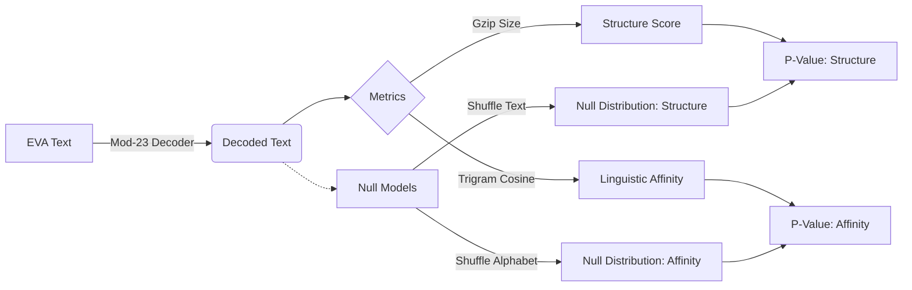

# Modular-23 Decoder for Voynich Manuscript

This repository contains an experimental framework to test the hypothesis that the Voynich Manuscript's text, specifically the "EVA" transcription, is not a random construction but rather a meaningful text encoded via a **modular-23 inverse mapping**.

---

## Hypothesis

This project tests whether a specific modular-23 inverse mapping from Voynich EVA glyph sequences into a 23-letter Latin alphabet produces output with measurable natural-language structure. After decoding, we compare:

*   **Compression** (gzip size)
*   **Character-level Shannon entropy**
*   **Index of coincidence**
*   **Trigram distribution similarity to Latin**

against appropriate null models (shuffled text and random monoalphabetic relabelings).

If the modular-23 mapping is meaningful, the decoded text should be more compressible and more trigram-similar to Latin than randomized controls, while maintaining entropy and index of coincidence in the typical range for real language.

---

## The Pipeline

The experiment flows through three stages: **Decode**, **Measure**, and **Verify**.



### 1. Decode
We map EVA glyphs to integers (1-23), compute their modular inverse ($x^{-1} \pmod{23}$), and map the result to a 23-letter Latin alphabet (`A`..`Z` excluding `J`, `K`, `U`).

### 2. Measure
We calculate metrics on the decoded text.
*   **Gzip Size:** A proxy for Kolmogorov complexity. Lower size = higher predictability/structure.
*   **Trigram Cosine Similarity:** Measures how "Latin-like" the letter triplets are.

### 3. Null Models (Monte Carlo)
To prove significance, we compare our observed metrics against 10,000 simulations:
*   **Text Shuffle:** Randomly scrambles characters. Tests if the *order* of characters matters (Structure).
*   **Alphabet Permutation:** Randomly swaps which number maps to which letter. Tests if the *specific mapping* matters (Linguistic Affinity).

---

## Sample Output

A typical run produces a JSON result and histograms.

```json
{
  "metrics": {
    "gzip": {
      "observed": 123456,
      "null_mean": 123980.2,
      "z_score": -1.69,
      "p_value_smaller": 0.045
    },
    "trigram_cosine": {
      "observed": 0.2741,
      "null_mean": 0.1123,
      "z_score": 5.22,
      "p_value_greater": 0.00001
    }
  }
}
```

*In this example, the observed text is significantly more Latin-like (p < 0.0001) than random mappings, providing support for the hypothesis.*

---

## Limitations & Known Caveats

While the results are intriguing, the following constraints must be acknowledged:

### Single transcription source
All experiments use the Takahashi EVA transcription as a fixed input. Different diplomatic transcriptions exist; any systematic differences in glyph segmentation or line handling will propagate into the statistics.

### EVA treats spaces as word boundaries
The pipeline inherits the assumption that spaces in the transcription correspond to meaningful “word” breaks. The underlying manuscript may encode line/paragraph structure differently than normal language.

### Tokenization treats EVA glyph groups as atomic symbols
Multi-character EVA sequences like `ch`, `sh`, `qo`, etc., are treated as single glyphs according to the standard EVA convention. Alternative segmentations (e.g., splitting these into smaller units) are not explored here.

### Allographic variation is collapsed
Scribal variants and subtle shape differences that may be meaningful in the manuscript are already normalized away in EVA, and thus invisible to this analysis.

### Layout and special markers ignored
Line-initial gallows behavior, paragraph-initial decoration, marginalia, and other layout-dependent features are not modeled. The experiment works only with linearized glyph strings.

### Uncertain/rare glyphs
Extremely rare or ambiguous glyphs are either mapped into a catch-all category or filtered out. This can slightly bias frequency-based measures, but is unlikely to dominate them.

---

## Usage

### Installation
```bash
pip install -r requirements.txt
```

### Running the Experiment
To run the full pipeline with 10,000 iterations and plotting enabled:

```bash
python run_experiment.py --n-iter 10000 --plot
```

### Options
*   `--eva <path>`: Path to EVA transcription file.
*   `--latin <path>`: Path to Latin reference corpus.
*   `--n-iter <int>`: Number of Monte Carlo simulations (default: 10,000).
*   `--seed <int>`: Random seed for reproducibility.
*   `--no-raw`: Exclude raw null distribution data from the JSON output (saves space).

---

## Reproduction

Results are saved to `results/`. You can analyze them using the provided notebook or script, or simply diff the JSON files to track how changes in the decoder affect the statistical significance of the translation.
